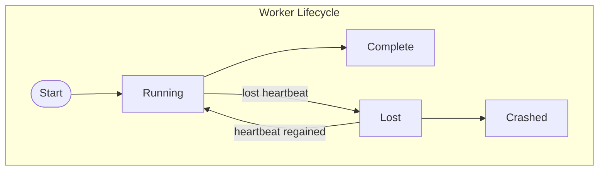
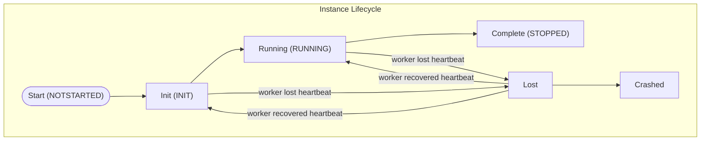
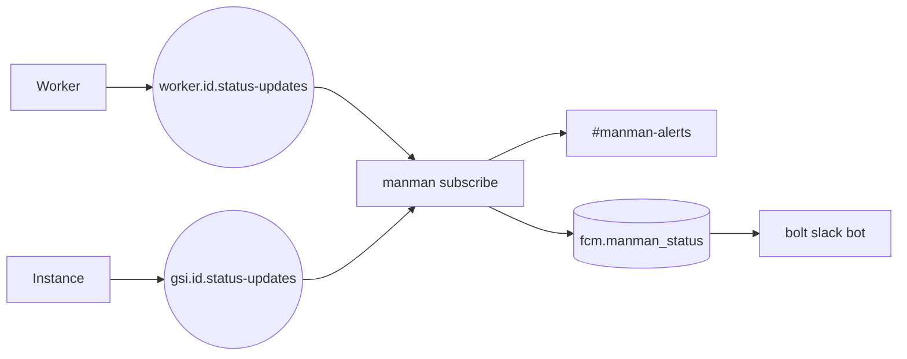

# manman subscribe

Subscribe to manman topics and do things

Covers both fcm and manman changes.

## Goals

- new event driven microservice
- subscribe to topics
- send messages based on topics
    - fancy slack block format
    - include buttons in message
    - buttons route actions to slack-bolt app

### Stretch Goals

- improve app naming
- rename worker/instance queue
    - `game-server-instance/worker.id.command`
- figure out how to make sql migrations run before pod startup
    - ideally uses a k8s or helm native approach
    - allows us to
        - remove startup checks
        - scale out

## Diagrams

Running = null end date, is_lost=False

Lost = null end date, is_lost=True

Crashed = NOT null end date, is_lost=True

Complete = null end date, is_lost=False

## Work to do

- fcm.manman_status table
    - object_type ("worker", "instance")
    - foreign_id ("worker_id", "instance_id")
    - status
    - as_of
    - ix_fcm_manman_status_foreign_id_as_of
        - object_type? low cardinality. at least include
            - colliding ids would likely be on very different pages
        - include status?
    - WHAT IS THE VALUE OF THIS TABLE?
        - medium value for debugging status edge cases
            - manman should technically do this on its own
            - and maybe it will
        - minor value for recovery logic
        - really low value for fallback for api
        - could probably do away with this
            - this is basically reverse engineering manman to get what manman already knows
        - try to avoid this as much as possible until absolutely neccessary
            - can still add it, just don't use it
        - consider adding this to manman instead
- manman subscribe
    - new service in fcm to subscribe to manamn events
    - does the writing to the db
    - does the slack alerts
    - what happens if this service goes down?
        - need some sort of true-up
        - can this be done via rabbit-mq?
            - every message must be consumed?
            - ack after durable?
        - can this be done via api calls?
            - how would this look?
            - look at current statuses every X seconds, verify with api?
            - at that point, why not just poll the api???
                - less live
                - less fun
            - this seems like it should be backup solution
- write status to manman_status
    - lookup information for bolt bot
        - can we trust it as a source of truth?
        - depends on recovery policy for manman subscribe
        - if it can be recovered within x seconds, then we can trust it
        - but I think we should still use live api in all cases
        - why not just do both live APi and this table?
            - encapsulate in lower function
            - favor live status when lost
    - also some debug in case things go wrong with codes
    - can be used to determine state machine flow
        - e.g. in the event of a recovery from lost
- Lost status for worker and instance
    - start using worker heartbeats
    - add something to hostapi (or new service) to monitor heartbeats
    - monitor identifies lost heartbeat
        - send lost status update
        - set is_lost=True
        - for all active instances on that worker
            - send lost status udate
            - set is_lost=True
    - if recovered (same worker_id)
        - send running status update
        - set is_lost=False
        - for all active instances on that worker
            - send running status update
            - set is_lost=False
- Terminated status for worker
    - happens automatically
    - next worker startup will set end date for other workers
    - this puts
- Terminated status for instance
    - need to add logic in manman host
    - when previous worker was lost and terminated, terminate the active instances
    - if previous worker was not lost, and just shutdown, or shutdown while it was lost, we will have some instances with no end date
        - I do not care
        - these are on old workers that should not serve requests anyways
        - so it doesn't matter if they are out of sync in some edge cases
- slack alerts
    - worker
        - start
            - send message
            - button for modal menu with server start
        - to-lost/from-lost
            - send message
            - list affected servers
            - from-lost should update to-lost message to indicate all-clear
        - stop
            - stop should list affected servers
        - ignore crashed, subsequent start will clear
            - could update lost message if really want to
            - it is technically the right thing to do
    - instance
        - start/init should send message
            - could (and should) treat them as as same status
            - init could update message almost immediately, but why spam for no gain
                - anything that would be gained from having a perfect paper trail in slack
                - would be moot because we already have the table
        - running should make commands available
            - stop
            - (future) kill
            - restart
                - indicate to user that this will create new instance
            - stdin box + button
            - modal pop up button for manman menu
        - lost
            - react with ghost emoji
            - post updates in thread below server
            - remove menu
            - restore menu if recovered, return to running
        - stop
            - should edit message and remove all commands
            - user communication/expecations
                - indicate that a new instance should be started
                  if they want to run commands or something again
                - try and avoid the "where command go"
- slack actions
    - general shape is still TBD
    - but we will need actions to support the buttons in the messages
    - these should re-use the existing actions used by the existing menu
- (optional) /manman command
    - CLI interface for manman to start/stop
        - `/manman testcs2`
            - start or do nothing if already running
        - `/manman stop testcs2`
            - stop or do nothing if not running
    - unrelated to this, but a cool idea
- (optional) start_date on worker/instance
    - may be useful, but not strictly required
