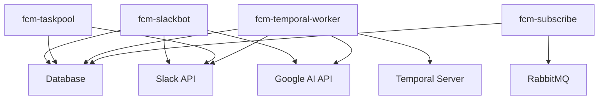

# FCM Microservices Architecture

This document describes the microservices split of the Friendly Computing Machine (FCM) application.

## Services Overview

The FCM application has been split into the following microservices:

### 1. FCM Slack Bot Service (`fcm-slackbot`)
- **Purpose**: Handles Slack WebSocket connections and real-time message processing
- **Deployment**: `fcm-slackbot-deployment`
- **CLI Command**: `fcm bot run-slack-only`
- **Dependencies**:
  - Slack Bot Token
  - Slack App Token
  - Database (for message storage)
- **Health Check**: Port 7654

### 2. FCM Task Pool Service (`fcm-taskpool`)
- **Purpose**: Runs scheduled background tasks (music polls, etc.)
- **Deployment**: `fcm-taskpool-deployment`
- **CLI Command**: `fcm bot run-taskpool`
- **Dependencies**:
  - Database (for task execution tracking)
  - Slack tokens (for some tasks)
- **Health Check**: Port 7654

### 3. FCM Temporal Worker Service (`fcm-temporal-worker`)
- **Purpose**: Executes Temporal workflows and activities
- **Deployment**: `fcm-temporal-worker-deployment`
- **CLI Command**: `fcm workflow run`
- **Dependencies**:
  - Temporal Server
  - Database
  - Various APIs (Google, Slack, etc.)

### 4. FCM Subscribe Service (`fcm-subscribe`)
- **Purpose**: Handles RabbitMQ message consumption
- **Deployment**: `fcm-subscribe-deployment`
- **CLI Command**: `fcm subscribe run`
- **Dependencies**:
  - RabbitMQ
  - Database

## Migration from Monolith

### Original Monolithic Service
The original `fcm bot run` command ran both the Slack bot and task pool in a single process using a thread pool executor.

### New Split Architecture
- **Slack Bot**: Now runs independently without the task pool
- **Task Pool**: Now runs as a separate service without the Slack bot
- **Backward Compatibility**: The original `fcm bot run` command still works and runs both services together

## Deployment Configuration

Each service has its own:
- Resource limits and requests
- Health checks
- Environment variables
- Service labels and selectors

## Benefits of Split Architecture

1. **Independent Scaling**: Each service can be scaled independently based on load
2. **Isolation**: Failures in one service don't affect others
3. **Resource Optimization**: Different resource allocations per service type
4. **Deployment Flexibility**: Services can be deployed and updated independently
5. **Debugging**: Easier to isolate issues to specific services

## Service Dependencies

**THIS IS NOT ACCURATE AND WAS AI GENERATED AS EWLL AS THIS WHOLE DOCUMENT BUT THIS WAS MOSTLY GOOD**

## CLI Commands Reference

| Service | Command | Description |
|---------|---------|-------------|
| Slack Bot Only | `fcm bot run-slack-only` | Run only Slack WebSocket handler |
| Task Pool Only | `fcm bot run-taskpool` | Run only background task processor |
| Temporal Worker | `fcm workflow run` | Run Temporal workflow worker |
| Subscribe Service | `fcm subscribe run` | Run RabbitMQ message consumer |
| Legacy Monolith | `fcm bot run` | Run both Slack bot and task pool together |
